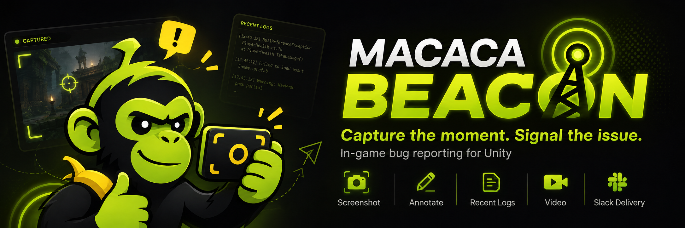

# Macaca Beacon

> Capture the moment. Signal the issue.



遊戲內、可抽離為 UPM 的 Bug Report 工具。它使用 **IMGUI**（不依賴 UGUI），桌面可用 F6 開啟，iOS／Android 則提供安全區角落的低干擾入口與三指長按手勢；工具會收集截圖、最近 log、裝置／build／場景資訊，並送到 Slack。

截圖預覽提供單層內建標注畫筆，圖片顯示後即可直接繪製，不需要進入另一個模式。工具列固定提供紅／黃／青三色、三種筆刷粗細、Undo、可復原的 Clear，以及重新截圖。完成的筆跡會合成進 Slack 與本地失敗備援所使用的 PNG。

## 專案內啟用

這個 repository 已將套件放在 `Packages/com.macacagames.beacon`，Unity 會把它視為 embedded package。桌面進入 Play Mode 後直接按 **F6** 即可開啟；不需要在 Scene 放 prefab。手機平台預設顯示一個只佔自身矩形的小型 `!` 入口，也可以用三指按住約 0.75 秒開啟。

第一次設定請開啟：

`Tools > Macaca Beacon > Open Settings`

設定資產會建立於 `Assets/Resources/BugReporterSettings.asset`。

`Appearance` 預設使用全螢幕並將介面縮放設為 1.25，寬螢幕採左右雙欄，小尺寸 Game View 自動切換成可捲動單欄。關閉 `Fullscreen` 後會改用置中視窗，並可調整背景遮罩透明度與桌面視窗寬度比例。

手機入口設定位於 `Mobile entry`：可分別關閉角落按鈕或三指手勢，調整按鈕尺寸／透明度／位置。按鈕會依 `Screen.safeArea` 避開瀏海與 Home indicator，只有觸控落在按鈕自己的矩形內時才會攔截事件，不會替整個遊戲畫面鎖定觸控。

## Slack 設定

1. 建立 Slack App，替 Bot 加入 `chat:write` 與 `files:write` scopes，然後安裝／重新安裝 App。
2. 將 `Bot Token` 與目標 `Channel ID` 填入 Macaca Beacon Settings。
3. 邀請該 App 加入目標 channel。

主回報固定由 Bot 使用 `chat.postMessage` 發送並取得父訊息 `ts`；附件再依 Slack 官方流程走 `files.getUploadURLExternal` → 檔案位元組上傳 → 帶有 `thread_ts` 的 `files.completeUploadExternal`，因此截圖、影片與 diagnostics 都位於主回報的 Thread。套件不使用 Incoming Webhook。

> 安全性：Bot Token 放進 Player 後可被擷取。僅建議內部／受信任測試使用。公開玩家版本應實作自己的 rate-limited relay，並以 `BugReporter.SetTransport(...)` 替換內建 transport；不要把 Slack secret 發佈給玩家。

## 會送出的資料

- 使用者輸入：分類、標題、描述、選填聯絡資訊
- PNG 截圖（按 F6、手機入口或三指手勢後、面板出現前擷取）
- 截圖上的選填畫筆標注
- Product、version、build GUID、Unity、platform、OS、CPU、RAM、GPU、VRAM、resolution、scene
- 有固定容量上限的 recent log ring buffer；Error／Exception 包含 stack trace
- 選填影片：macOS／Windows／Android／iOS 優先 H.264 MP4，預設 6 FPS、前 8 秒＋後 1 秒、無音訊

表單內會顯示資料用途聲明；內容可由 Settings 自訂。請依發行地區及資料內容完成實際隱私／同意流程。

## 錄影限制

`Enable Rolling Video` 預設關閉。啟用後會使用 `AsyncGPUReadback` 擷取縮放後的 RGBA frame，非同步寫入 `Application.temporaryCachePath` 的有時限 ring buffer。正常路徑不再建立 `Texture2D`、不執行 `EncodeToJPG`，也不把完整 rolling frame 集合常駐 managed heap。事件完成編碼或 runtime 關閉錄影後，raw cache 會自動清除。只有不支援 async GPU readback 的裝置才使用低頻 JPEG compatibility fallback。

`Maximum Video Cache Megabytes` 預設為 512 MB。直式 960 px、6 FPS、8 秒歷史通常需要比橫式畫面更多 temporary space；raw cache 超過上限時會先丟棄最舊 frame，因此低儲存空間裝置的實際保留秒數可能短於 `Seconds Before`。啟動事件時會在 log 顯示 requested 與 available 秒數。這個限制只影響 temporary raw cache，最終 MP4 仍由 bitrate 與附件大小限制控制。

macOS Editor／Standalone Player 與 iOS device／Simulator 會優先使用 Metal texture → IOSurface-backed CVPixelBuffer 的 GPU 路徑，再由 AVAssetWriter 產生 H.264 MP4；若 Apple GPU bridge 不可用，才回到 `AsyncGPUReadback` 的 CPU/native 路徑。macOS 使用套件內的 Universal Binary（Apple Silicon + Intel），iOS 則由 Unity 產生 Xcode project 時直接編入相同的 Apple native implementation。Windows Editor／64-bit Standalone Player 使用 Windows 內建 Media Foundation H.264 encoder。Windows 與 Apple CPU fallback 直接接受 RGBA frame，不再經過 JPG encode/decode；不需要 ffmpeg 或隨 Player 安裝額外 codec。MIME type 都是 `video/mp4`，且會把 MP4 metadata 寫在 media data 前面，方便 Slack／瀏覽器提早建立預覽。

影片先寫進 `Application.temporaryCachePath`，建立 report 時再交易式複製到 PendingReports，Slack 則使用 `UploadHandlerFile` 直接由檔案上傳，避免另一份完整影片常駐 managed heap。Windows 與 Apple backend 在背景 thread 完成；Android 由 Unity main thread 啟動 Java encode job，實際檔案讀取、RGBA → YUV420 與 MediaCodec finalization 都在低優先序 Java worker 執行。回報表單在背景編碼期間仍可正常輸入，Send 會等影片 ready 後才開放。

`Prefer Mp4` 預設開啟。若目前平台尚無 MP4 backend，或原生 H.264 encoder 暫時不可用，`Allow Legacy Avi Fallback` 可讓回報退回純 C# MJPEG AVI，而不是整份報告失敗。目前正式 MP4 backend 支援矩陣：

| 平台 | Runtime 影片輸出 |
|---|---|
| macOS Editor | H.264 MP4；可選 AVI fallback |
| macOS Standalone (Intel / Apple Silicon) | H.264 MP4；可選 AVI fallback |
| Windows Editor (x64) | H.264 MP4；可選 AVI fallback |
| Windows Standalone (x64) | H.264 MP4；可選 AVI fallback |
| iOS device／Simulator | Metal GPU + AVAssetWriter H.264 MP4；GPU 不可用時回退 CPU；可選 AVI fallback |
| Android device | H.264 MP4（MediaCodec／MediaMuxer）；可選 AVI fallback |
| Linux | 目前使用 AVI fallback；介面已保留平台 encoder 擴充點 |
| WebGL | WebCodecs H.264 + 內建 MP4 muxer；不支援時可選 AVI fallback |

macOS native source 位於 `Native~/macOS`，執行 `build.sh` 可重建 `Runtime/Plugins/macOS/MacacaBeaconVideo.bundle`。它只連結 Apple 系統 framework，沒有額外第三方 runtime dependency。

Windows native source 位於 `Native~/Windows`。在裝有 Visual Studio 2022「Desktop development with C++」與 Windows 10/11 SDK 的 Windows 主機執行 `build.ps1`，即可重建 `Runtime/Plugins/Windows/x86_64/MacacaBeaconVideoWindows.dll`；macOS package 維護者也可安裝 MinGW-w64 後執行 `build-cross.sh`。正式支援 Windows 10/11 x64；32-bit Windows、UWP 與 ARM64 目前不在 PluginImporter 支援範圍。

iOS 使用 `Runtime/Plugins/iOS/MacacaBeaconVideo.mm`，由 Unity 產生 Xcode project 時直接編入，透過 `DllImport("__Internal")` 呼叫 Metal render-event bridge 與 AVAssetWriter。GPU 路徑直接把 Unity Metal texture blit 到 IOSurface-backed CVPixelBuffer，並使用 iOS 硬體 H.264 路徑；PluginImporter 會加入 AVFoundation、CoreGraphics、CoreMedia、CoreVideo、ImageIO、Metal 與 VideoToolbox。不需要在 Scene 放置額外元件。

Android 使用 `Runtime/Plugins/Android/MacacaBeaconVideo.java`，透過 Android 內建的 `MediaCodec` 與 `MediaMuxer` 將 RGBA frame 轉換為 encoder 支援的 YUV420 並編碼為 H.264 MP4；不需要額外安裝 ffmpeg 或加入錄影權限。

其他平台可以實作 `IVideoEncoderBackend`，並在遊戲初始化時呼叫 `BugReporter.SetVideoEncoder(backend)`。Backend 會收到含 frame format、尺寸、temporary data path 與 realtime timestamp 的唯讀 frame list，並可用 `ReadData()` 逐張載入，避免一次載入整段影片；成功後套件會自動接手本地 staging、Slack 上傳與清理。

每個 frame 會記錄 double precision realtime timestamp，歷史緩衝依秒數而非 frame 數裁切。MP4 使用各 frame 的實際 presentation timestamp，並將最後一幀延伸到設定的 incident end；AVI fallback 也依實際捕捉時長產生時基。裝置無法達到設定 FPS 時只會降低流暢度，不會再把 8 秒內容加速成較短影片。若 Play Mode／Player 啟動尚未滿 `Seconds Before`，則只能保留啟動後實際存在的歷史畫面。

WebGL 使用瀏覽器原生 WebCodecs H.264 encoder，再由套件內的 MP4 muxer 封裝輸出；不使用 WebGPU 直接編碼，也不需要在遊戲啟動時下載 ffmpeg。瀏覽器必須支援 H.264 `VideoEncoder`、`VideoFrame` 與 `createImageBitmap`，且通常需要 HTTPS 或 localhost。若瀏覽器不支援 WebCodecs，`Allow Legacy Avi Fallback` 開啟時會退回 managed MJPEG AVI。

為避免記憶體／Slack 上傳失控，每個附件受 `Maximum Attachment Megabytes` 限制。影片不包含音訊，UI 在後段畫面收集與影片封裝完成前會暫時停用 Send。

## 本地失敗備援

`Save Failed Reports Locally` 預設開啟。送出時會先將 `report.txt`、截圖、影片與 diagnostics 暫存到 `Application.persistentDataPath/MacacaBeacon/PendingReports`；Slack 全部成功後才刪除該資料夾。任何訊息／附件上傳失敗或程式在傳輸途中關閉，檔案都會保留供事後手動上傳，UI 與 Unity Console 會顯示實際路徑。預設只保留最近 20 份，可用 `Maximum Retained Local Reports` 調整。

## 自訂遊戲資料

```csharp
using MacacaGames.RuntimeBugReporter;

public sealed class GameBugContext : IBugReportDataProvider
{
    public void Collect(BugReport report)
    {
        report.Fields["Quest"] = QuestService.CurrentQuestId;
        report.Fields["Player Position"] = Player.Position.ToString();
    }
}

// 初始化時
BugReporter.RegisterDataProvider(new GameBugContext());
```

也可手動呼叫 `BugReporter.Open()`，或用 `BugReporter.SetTransport(customTransport)` 注入任何 `IBugReportTransport`。

Rolling video 也提供 runtime API，可在遊戲內依效能或隱私需求切換；切換不會修改 Settings asset：

```csharp
using MacacaGames.RuntimeBugReporter;

BugReporter.SetVideoRecordingEnabled(false);
bool enabled = BugReporter.IsVideoRecordingEnabled;
```

若專案使用 SRDebugger，可從 Unity Package Manager 匯入 `SRDebugger Integration` sample。匯入後，`SROptions.MacacaBeacon.cs` 會被複製到 `Assets`，將同一個開關放入 `SRDebugger > Options > Macaca Beacon`。這個整合檔不會由 Beacon runtime 自動編譯，因此 Beacon package 本身不引用 SRDebugger，也不會產生 assembly dependency。

## 分享至其他專案

### 方式 A：以 Git submodule 匯入（推薦內部／多專案共用）

在 Unity 專案的 repository 根目錄執行：

```bash
git submodule add https://github.com/MacacaGames/MacacaBeacon.git Packages/com.macacagames.beacon
git submodule update --init --recursive
```

如果公司 Git 只允許 SSH，也可以使用：

```bash
git submodule add git@github.com:MacacaGames/MacacaBeacon.git Packages/com.macacagames.beacon
```

確認 `Packages/com.macacagames.beacon/package.json` 存在後，回到 Unity 開啟／重新載入專案即可。這種方式會在主專案留下 `.gitmodules` 與一個 submodule commit 指標；請把兩者一起提交：

```bash
git add .gitmodules Packages/com.macacagames.beacon
git commit -m "Add Macaca Beacon package"
```

其他人第一次 clone 主專案時，使用：

```bash
git clone --recurse-submodules <your-game-repository-url>
```

若已經 clone 但資料夾是空的，執行：

```bash
git submodule update --init --recursive
```

要更新套件版本時，先在 submodule 取得指定 tag 或 commit，再把主專案的 submodule 指標提交：

```bash
git -C Packages/com.macacagames.beacon fetch --tags origin
git -C Packages/com.macacagames.beacon checkout v0.3.0
git add Packages/com.macacagames.beacon
git commit -m "Update Macaca Beacon"
```

`checkout` 後 submodule 顯示 detached HEAD 是正常的；版本由主專案記錄的 commit 決定。若要在套件 repository 內開發，先切換到自己的 branch，完成後再回主專案提交新的 submodule 指標。

### 方式 B：以 UPM Git URL 匯入

將 `com.macacagames.beacon` 保持在獨立 Git repository 後，其他 Unity 專案也可在 `Packages/manifest.json` 加入：

```json
"com.macacagames.beacon": "https://github.com/your-org/macaca-beacon.git?path=/com.macacagames.beacon#v0.1.0"
```

套件 managed runtime assembly 沒有第三方相依；需要 Unity 的 IMGUI、UnityWebRequest、ScreenCapture 與 ImageConversion built-in modules。macOS／iOS MP4 backend 使用系統內建的 AVFoundation、VideoToolbox、CoreMedia、CoreVideo 與 Metal frameworks；Windows MP4 backend 使用系統內建的 Media Foundation 與 COM；Android MP4 backend 使用系統內建的 MediaCodec 與 MediaMuxer。ImageIO、WIC 與 Bitmap APIs 僅保留給 JPEG compatibility fallback。

## 參考

- [Slack `chat.postMessage`](https://docs.slack.dev/reference/methods/chat.postMessage)
- [Slack external file upload](https://docs.slack.dev/reference/methods/files.getUploadURLExternal/)
- [Unity User Reporting 概念](https://docs.unity.com/en-us/cloud-diagnostics/user-reporting/about-user-reporting)
- [PE 工具箱：遊戲內 Bug Reporter](https://qwe321qwe321qwe321.github.io/posts/13673/)
